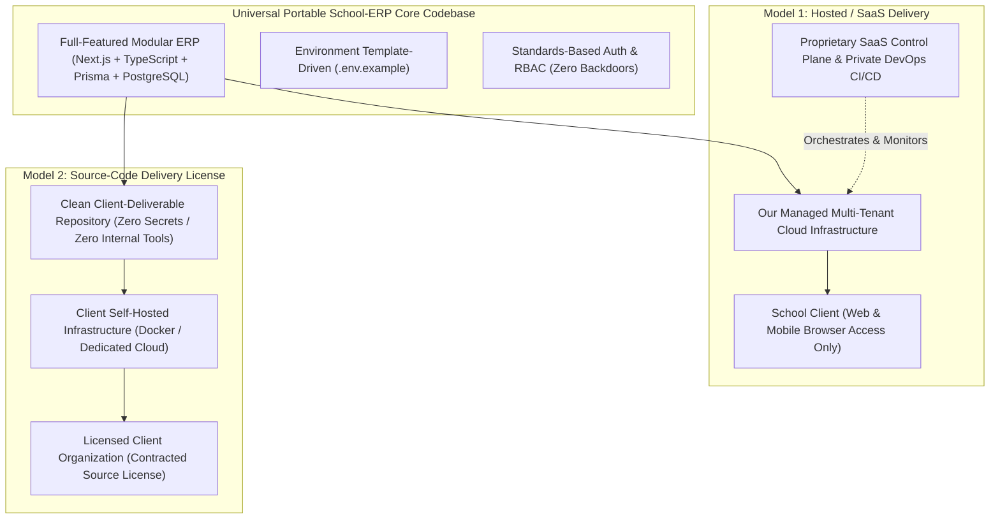

# School-ERP: Commercial Delivery Modes & Packaging Architecture

## 1. Executive Summary & Dual Commercial Delivery Models

The School-ERP is architected to support two distinct commercial distribution models:

---

## 2. Model 1: Hosted / SaaS Delivery Model
- **Client Experience**: The client school receives authorized access to their web portals (Admin, Staff, Teacher, Student, Parent) via their dedicated subdomain or custom domain.
- **Repository Security**: Source code repository remains 100% private and protected.
- **Infrastructure Management**: Hosting, database backups, disaster recovery, security patching, and platform upgrades are managed by our platform team.

---

## 3. Model 2: Source-Code Delivery Model (Enterprise Licensing)

Selected clients may purchase or license the source code under specific commercial contract terms. To ensure professional delivery, the codebase adheres to strict portability and isolation standards:

### 3.1. Clean & Portable Client-Deliverable Codebase
- The codebase is self-contained and completely portable. A client can install standard prerequisites (Node.js LTS, PostgreSQL), configure their environment, run migrations, and launch the application seamlessly.
- **Zero Proprietary Infrastructure Lock-in**: The ERP core does not require proprietary third-party binaries, hidden external services, or hardcoded platform endpoints to function.

### 3.2. Absolute Secret & Credential Sanitization
- **No Real Secrets in Code**: Zero production passwords, API keys, JWT signing secrets, database credentials, or private certificates are ever committed to the repository.
- **Environment Template (`.env.example`)**: The repository includes a comprehensive, documented `.env.example` file. All secrets and environment variables are injected at deployment time.
- **No Cross-Client or Internal Data**: Delivered source code contains zero sample data, test accounts, or operational traces of other clients or internal staging environments.

### 3.3. Proprietary Tooling & Master Control Plane Decoupling
- **Proprietary Master Control Plane**: Our internal multi-tenant SaaS billing engines, master subscription orchestrators, and private deployment automation remain in our private repositories.
- **Client-Deliverable Core**: Operates autonomously as a full-featured, self-contained single-school ERP with its own built-in School Super Admin management.
- **Private Data Migration Tool**: Stays 100% outside the client-deliverable repository, routes, APIs, UI, and documentation.

### 3.4. Standards-Based Security (Zero Backdoors)
- The application contains **zero developer backdoors, hardcoded bypasses, or secret administrative master keys**.
- All security mechanisms (Argon2id password hashing, TOTP MFA, session verification, 10-action RBAC, input sanitization) are completely transparent, standard, and verifiable.

---

## 4. Documentation Strategy by Delivery Mode

| Documentation Type | Target Audience | Location | Visibility |
| :--- | :--- | :--- | :--- |
| **Hosted Deployment Runbook** | Internal DevOps / Platform Team | [`HOSTED_DEPLOYMENT_GUIDE.md`](file:///d:/School%20Management/docs/architecture/HOSTED_DEPLOYMENT_GUIDE.md) | Internal only |
| **Source-Code Handover Guide** | Licensed Enterprise Clients & Client Technical Teams | [`SOURCE_CODE_HANDOVER_GUIDE.md`](file:///d:/School%20Management/docs/architecture/SOURCE_CODE_HANDOVER_GUIDE.md) | Client-Deliverable |
| **Client User Manuals** | School End-Users (Teachers, Staff, Parents, Students, Admins) | `/docs/user_manuals/` | Standalone Printable Deliverable |
| **Internal Feature Technical Specs** | Core Developers | `/docs/modules/` | Internal Repository |
