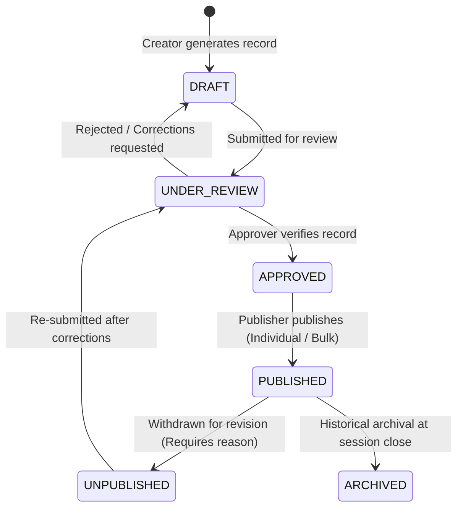

# School-ERP: Central Publishing Engine

## 1. Objective & Design Goals
Important academic, financial, and administrative records must never be leaked or visible to students, parents, or general employees until they have undergone a controlled, audited review and approval cycle.

The **Central Publishing Engine** establishes a unified state machine and visibility barrier across all publishable entities in the School ERP.

---

## 2. Publishable Entity Scope
The engine standardizes workflows across:
1. **Fee Vouchers** (`FEE_VOUCHER`)
2. **Exam Results** (`EXAM_RESULT`)
3. **Student Result Cards** (`RESULT_CARD`)
4. **Class & Exam Timetables** (`TIMETABLE`)
5. **School Circulars & Notices** (`NOTICE`)
6. **Employee Payslips** (`PAYSLIP`)
7. **Official School Documents & Certificates** (`DOCUMENT`)

---

## 3. Universal Publishing State Machine



### State Definitions
- **`DRAFT`**: Initial editable state. Visible only to author and module managers.
- **`UNDER_REVIEW`**: Locked against inline edits while awaiting administrative review.
- **`APPROVED`**: Formally verified by an authorized officer (`APPROVE` permission). Ready to be scheduled or published.
- **`PUBLISHED`**: Actively visible on target portals (Student, Parent, Employee, Teacher) according to audience filters.
- **`UNPUBLISHED`**: Immediately hidden from portal users. Requires a mandatory audit reason.
- **`ARCHIVED`**: Read-only permanent historical record.

---

## 4. Bulk Publishing Engine & Dry-Run Preview
When publishing in bulk (e.g., publishing monthly fee vouchers or result cards):
1. **Phase 1: Dry-Run Preview**
   - Scans candidate records matching criteria within the tenant.
   - Validates prerequisites (e.g. all marks entered, vouchers verified).
   - Returns a summary preview with ready counts and itemized blocked records.
2. **Phase 2: Atomic Execution**
   - The user reviews the preview and confirms with approval.
   - Executes in an ACID database transaction or batch processor.
   - Creates a `PublishingBatch` entry and records audit logs for all updated records.

---

## 5. Portal Visibility Gating Middleware
All query handlers for Student, Parent, and Employee portal endpoints automatically append the publishing filter:

```sql
WHERE entity.tenant_id = :current_tenant_id
  AND entity.publishing_status = 'PUBLISHED'
  AND entity.target_audience @> ARRAY['STUDENT']::varchar[]
```
This guarantees zero accidental data leakage from draft or under-review modules.

