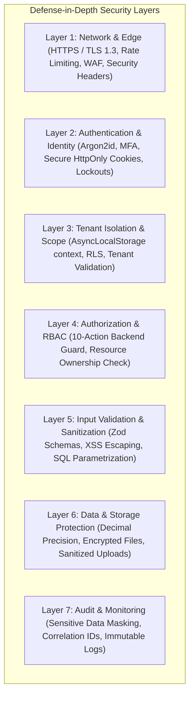

# School-ERP: Commercial Security & Authorization Architecture

## 1. Commercial Security Baseline

The ERP is designed to meet strict commercial SaaS and enterprise security standards:



---

## 2. Authentication & Identity Protection

### 2.1. Multi-Portal Authentication
- Dedicated authentication and session boundaries for **Admin**, **Employee / Staff**, **Teacher**, **Student**, and **Parent** portals.
- Tenant context is resolved before authentication to prevent credential stuffing across school accounts.

### 2.2. Password Security & Cryptography
- **Hashing Algorithm**: Argon2id (`memory_cost=64MB, time_cost=3 iterations, parallelism=4 threads`) with cryptographically secure random per-user salt.
- **Complexity Policies**: Minimum 8 characters with alphanumeric and special character enforcement.

### 2.3. Multi-Factor Authentication (MFA) Capability
- Built-in support for **Time-based One-Time Passwords (TOTP / Authenticator Apps)**.
- Mandatory or configurable MFA for privileged roles:
  - Platform Product Owner
  - School Super Admin
  - Finance / Payroll Officers
- Backup recovery codes cryptographically hashed and stored securely.

### 2.4. Session & Token Management
- Sessions stored in `HttpOnly`, `Secure`, `SameSite=Strict` cookies.
- Server-side session validation with automatic activity timeouts (configurable, default 60 minutes).
- Immediate session revocation upon password reset or role modification.

### 2.5. Rate Limiting & Brute-Force Defense
- Global and route-specific rate limiters (e.g. max 5 failed login attempts per IP/account window ➔ 15-minute progressive lockout).
- Exponential backoff on failed authentication attempts.

---

## 3. Web Application Security & Hardening (OWASP Compliance)

1. **SQL Injection Protection**:
   - 100% parametrized queries via Prisma ORM. Raw SQL queries strictly prohibited in application business logic.
2. **Cross-Site Scripting (XSS) Prevention**:
   - Automatic output encoding in React/Next.js; input HTML stripping and sanitization via DOMPurify / sanitize-html on rich text notice fields.
3. **Cross-Site Request Forgery (CSRF) Protection**:
   - SameSite=Strict cookies combined with anti-CSRF token validation on all state-mutating requests.
4. **Security Headers & Transport Security**:
   - `Content-Security-Policy (CSP)`
   - `Strict-Transport-Security (HSTS: max-age=31536000; includeSubDomains; preload)`
   - `X-Frame-Options: DENY`
   - `X-Content-Type-Options: nosniff`
   - `Referrer-Policy: strict-origin-when-cross-origin`
   - `Permissions-Policy: camera=(), microphone=(), geolocation=()`
5. **Secure File Upload Pipeline**:
   - File uploads validated by Magic Byte MIME-type inspection (not just file extension).
   - Filenames sanitized and randomized (UUIDv4) to prevent path traversal (`../`) attacks.
   - Files stored in isolated tenant directories outside the public web root.
6. **Production Error Logging & Information Leakage Prevention**:
   - Production error responses mask internal stack traces and database error details, returning clean, localized error codes to clients.
   - Structured server logs sanitize and mask sensitive data (passwords, tokens, bank card numbers, CNIC/national IDs).

---

## 4. Authorization: 10-Action Granular RBAC / PBAC

Every module enforces 10 granular actions at the backend service layer:
`VIEW`, `CREATE`, `EDIT`, `DELETE`, `APPROVE`, `PRINT`, `EXPORT`, `PUBLISH`, `UNPUBLISH`, `REVERSE`.

```typescript
// Backend Authorization Guard Example
export async function authorizeAction(
  user: AuthenticatedUser,
  tenantId: string,
  module: ModuleCode,
  action: ActionCode,
  resourceTenantId?: string
) {
  // 1. Enforce strict tenant boundary
  if (resourceTenantId && resourceTenantId !== tenantId) {
    throw new SecurityViolationError('Cross-tenant resource access prohibited');
  }

  // 2. Platform Owner isolation (School Admins cannot execute platform owner actions)
  if (module === 'PLATFORM_OWNER' && !user.isPlatformOwner) {
    throw new ForbiddenError('Access restricted to Platform Owner');
  }

  // 3. Resolve user role and permission matrix
  const permitted = await resolvePermission(user.id, tenantId, `${module}:${action}`);
  if (!permitted) {
    throw new ForbiddenError(`Lacks permission: ${module}:${action}`);
  }
}
```

---

## 5. Universal Tenant-Aware Audit Trail
Every critical operational, financial, publishing, and administrative change is logged to `AuditLog`:
- Fields: `tenant_id`, `user_id`, `user_role`, `ip_address`, `timestamp`, `module`, `entity_type`, `entity_id`, `action`, `old_values` (JSON), `new_values` (JSON), `change_summary`, `request_id`.
- Immutable log records protected from client-side modification.

