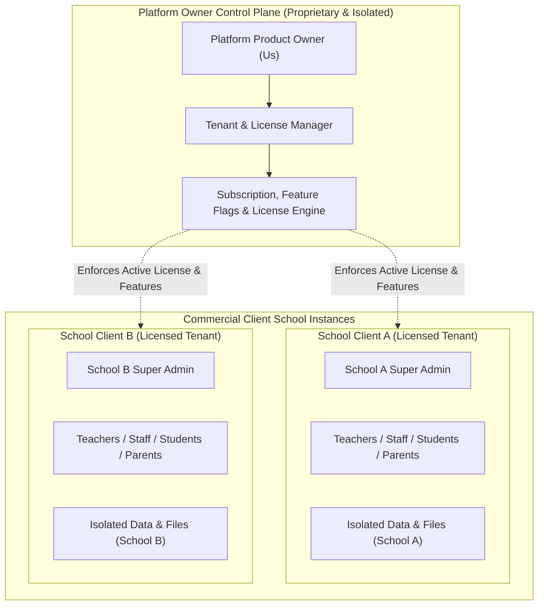
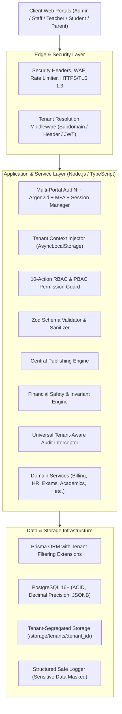

# School-ERP: System Architecture & Technical Foundation

## 1. System Scope & Commercial Product Model

### 1.1. Commercial Software Architecture
**School-ERP** is engineered as a commercial product to be licensed and sold to multiple independent school organizations.
- **Independent School Tenants**: Each licensed school operates with 100% data isolation, independent operational configurations, separate academic calendars, distinct user bases, and segregated financial ledgers.
- **Single-Campus Simplicity per School**: A school installation/tenant represents a single school organization. The ERP does **not** introduce campus-branch hierarchies or multi-branch complexity inside a school's operational workflows.
- **Flexible Commercial Deployment Topologies**:
  1. **Multi-Tenant SaaS Topology**: Multiple school clients hosted on a scalable, shared cloud cluster with strict software-level and database-level tenant isolation (`tenant_id` context propagation, PostgreSQL Row-Level Security / schema routing).
  2. **Dedicated Private Cloud / On-Premises Deployment**: High-tier or enterprise clients can receive a dedicated instance running the identical codebase with dedicated database and storage volumes.
  3. **Zero Codebase Divergence**: The core ERP architecture supports both SaaS and dedicated topologies using the same codebase, controlled via tenant context configuration.

### 1.2. Product Owner vs. School Tenant Separation
The platform strictly separates the **Platform Product Owner** from the **School Super Admin**:
- **Platform Owner (Us)**: Manages client subscriptions, licenses, tenant provisioning, system health, product versions, module feature flags, and global licensing controls via a protected, isolated platform plane.
- **School Super Admin (Client)**: Has administrative control *only* within their own school tenant (managing their teachers, students, fees, classes, payroll, and settings). A School Super Admin has **zero access** to other schools' data or platform-owner administration.

---

## 2. Production Technology Stack Recommendation

### 2.1. Layered Architecture Overview

### 2.2. Technology Selections
- **Frontend Framework**: Next.js 15+ (App Router) with TypeScript.
- **Styling & UI Components**: Tailwind CSS v4, Radix UI (Shadcn UI), mobile-responsive portal layouts.
- **Localization**: `next-intl` bilingual setup (English LTR / Urdu RTL) with Noto Nastaliq Urdu typography.
- **Backend & API**: TypeScript on Node.js v24 LTS; Modular Clean Service Layer; Server Actions & API Route Handlers.
- **Database & ORM**: PostgreSQL 16+ with Prisma ORM. Strict Decimal(`DECIMAL(12,2)`) precision for financial records.
- **Tenant Context Propagation**: `AsyncLocalStorage` in Node.js, ensuring every query, log, cache key, and storage path is automatically bound to the active `tenant_id`.

---

## 3. Intellectual Property (IP) Protection & Security Principles
1. **Proprietary Source Code Protection**:
   - The ERP repository is private. Clients receive runtime application access under commercial license, never raw source code repository rights.
   - Internal developer documentation, system architectural notes, and internal issue trackers are **never** exposed in the client ERP interface.
2. **Zero Internal Secret Exposure**:
   - Secrets, database credentials, encryption keys, and environment variables are strictly managed server-side and never leaked in client bundles or public APIs.
3. **No Hidden Backdoors**:
   - Platform owner administrative operations are conducted through cryptographically secured, audited management APIs without backdoor user accounts or hardcoded bypasses.
4. **Server-Side Invariant Enforcement**:
   - All critical business logic, financial rules, and permission checks are enforced strictly on the backend. Frontend UI adaptation is strictly an ergonomics layer.
5. **Private Developer Tools Exclusion**:
   - The private Data Migration Tool is completely excluded from this repository, web routes, APIs, UI, and documentation.

