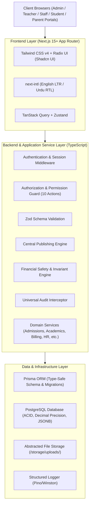

# School-ERP: System Architecture & Technical Foundation

## 1. System Scope & Guiding Principles
- **Deployment & Topology**: Single school / single campus architecture.
- **Modularity**: Domain-Driven Modular Monolith with clear bounded contexts, independent domain services, strict encapsulation, and clean API contracts.
- **Bi-lingual & RTL Native**: English (LTR) and Urdu (RTL) localization built into the core design from day one.
- **Multi-Portal Experience**: Specialized, responsive web portals for:
  1. **Admin Portal**: Complete school operations, settings, finance, approvals, publishing, and audit logs.
  2. **Employee / Staff Portal**: HR profile, attendance, leave management, payroll/payslips.
  3. **Teacher Portal**: Class management, subject attendance, timetable, exam marks entry, student progress.
  4. **Student Portal**: Timetable, attendance records, published fee vouchers, exam results, notice board.
  5. **Parent Portal**: Multi-child switcher, fee voucher downloads, online/bank payment history, attendance tracking, report cards, school circulars.
- **Financial & Data Integrity**: ACID transactions, ledger-backed double-entry accounting, immutable receipts, safe two-phase bulk operations.
- **Data Privacy**: Complete exclusion of private migration tools from the application code, UI, API, or repo.

---

## 2. Production Technology Stack Recommendation



### 2.1. Frontend Architecture
- **Framework**: Next.js 15+ (App Router) with TypeScript. Server-side rendering (SSR) for portal shells and fast first paint; React Server Components + Client Components for rich interactive forms.
- **Styling & Theming**: Tailwind CSS v4 with dynamic CSS variables for themes and direction switching (`dir="ltr"` / `dir="rtl"`).
- **Component Library**: Radix UI primitives / Shadcn UI for accessible, mobile-first responsive components (dialogs, dropdowns, tables, sheets, tabs).
- **Localization**: `next-intl` providing server & client translation hooks, date/currency formatting, and Noto Nastaliq Urdu font integration.
- **Client State & Caching**: TanStack Query (React Query) for optimistic UI updates, background caching, and automatic invalidation; Zustand for global client state (session context, active portal switch, selected academic session).

### 2.2. Backend Architecture
- **Pattern**: Modular Layered Architecture (Clean Architecture):
  - `Presentation Layer`: API Route Handlers / Server Actions validating inputs and checking permissions.
  - `Application Layer`: Orchestration services, DTOs, and transaction coordinators.
  - `Domain Layer`: Pure business logic, financial invariant enforcers, GPA calculators, fee discount calculators, publishing state machines.
  - `Infrastructure Layer`: Prisma ORM repositories, database adapters, local/cloud storage providers, notification dispatchers, logger.
- **Language & Runtime**: TypeScript on Node.js v24 LTS.

### 2.3. Database & ORM
- **Database Engine**: PostgreSQL 16+.
  - *Why PostgreSQL?* Robust ACID transactions, row-level locking (`SELECT FOR UPDATE`), exact precision `NUMERIC(12,2)` for financial calculations, JSONB for historical snapshots and audit logs, foreign keys with referential constraints.
- **ORM**: Prisma ORM.
  - *Why Prisma?* Strict compile-time TypeScript type safety across queries, declarative migrations (`prisma migrate`), expressive transactions (`prisma.$transaction`), and seamless relation loading.

### 2.4. Authentication & Session Management
- **Strategy**: Multi-Portal HTTP-Only Secure Cookie Session management with signed tokens.
- **Password Security**: Argon2id hashing with per-user salt.
- **Account Protection**: Rate limiting, brute-force lockout after 5 consecutive failed attempts, CSRF protection, secure password reset tokens with 15-minute expiry.
- **Role Multi-tenancy**: Single login screen or portal-specific login paths routing users directly to their permitted portal based on active role.

### 2.5. Authorization (RBAC & PBAC)
- **10 Core Actions**:
  1. `View`: Read access to list and detail views.
  2. `Create`: Initiate new records.
  3. `Edit`: Modify existing mutable records.
  4. `Delete`: Safely remove unlinked, eligible draft records.
  5. `Approve`: Authorization to move items from Review to Approved status.
  6. `Print`: Access to formal print layouts (Challans, Result Cards, Payslips).
  7. `Export`: Access to CSV/Excel/PDF bulk exports.
  8. `Publish`: Make approved records visible to targeted portals (Student, Parent, Employee).
  9. `Unpublish`: Withdraw records from portal visibility back to draft/review.
  10. `Reverse`: Initiate financial reversals or adjustments with mandatory reason and ledger impact.
- **Enforcement**: Mandatory backend middleware guards (`checkPermission(module, action)`) wrapping every API route and server mutation.

### 2.6. Validation & Error Handling
- **Validation**: Schema-first validation with Zod. Input schemas shared or reused between frontend forms and backend API handlers.
- **Error Handling**: Standardized RFC 7807 compliant error format:
  ```json
  {
    "success": false,
    "error": {
      "code": "FINANCIAL_INVARIANT_VIOLATION",
      "message": "Paid vouchers cannot be deleted. Use the Reversal workflow instead.",
      "details": { "voucherId": "VCH-2026-0042", "paidAmount": 4500 }
    }
  }
  ```

### 2.7. File & Document Storage
- Abstracted `StorageService` interface.
- Local disk storage initially organized under:
  - `/storage/uploads/avatars/`
  - `/storage/uploads/student_documents/`
  - `/storage/uploads/staff_documents/`
  - `/storage/uploads/fee_receipts/`
  - `/storage/uploads/exam_attachments/`
  - `/storage/exports/`
- Strict file validation: MIME-type verification, magic number inspection, filename sanitization, max upload size limits (e.g. 5MB for docs, 2MB for photos).

### 2.8. Logging & Observability
- Structured JSON logging using Pino / Winston with log levels: `ERROR`, `WARN`, `INFO`, `HTTP`, `DEBUG`.
- Correlation ID (`x-request-id`) propagated through every request lifecycle and logged in all database queries and audit events.
- Daily rotating log files saved to `/storage/logs/`.

### 2.9. Testing Strategy
- **Unit Testing**: Vitest for pure business logic (fee calculation, discount policy hierarchy, GPA and grading formulas, timetable conflict detection, permission resolution).
- **Integration Testing**: Supertest & database test fixtures for API routes, transactional integrity, publishing state transitions, and financial reversal invariants.
- **E2E Testing**: Playwright for cross-portal workflows, responsive UI checks on mobile/tablet/desktop, and Urdu RTL layout verification.

### 2.10. Backup & Disaster Recovery Strategy
- Daily automated database dump (`pg_dump`) executed via scheduled background task, compressed and timestamped.
- Daily file storage archive backup.
- Point-in-time recovery (PITR) enabled via WAL archiving in production.
- Automated health check endpoint (`/api/health`) verifying database connectivity, storage disk space, and memory usage.
