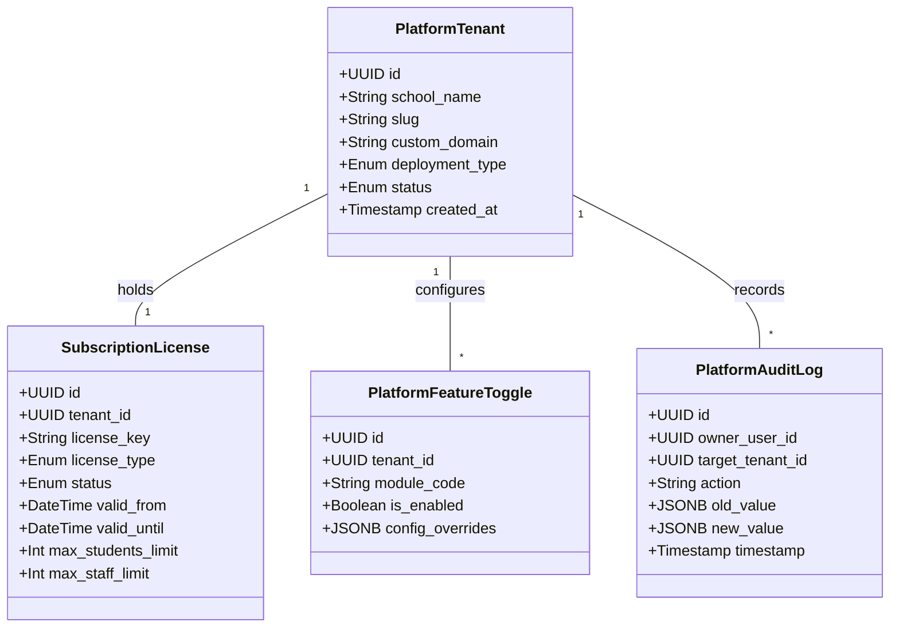

# School-ERP: Tenant Isolation & Platform Control Architecture

## 1. Commercial Tenant Isolation Strategy

To ensure zero cross-school data leakage across all licensed institutions, the ERP enforces strict multi-tenant isolation across all layers:

### 1.1. Tenant Context Resolution & Injection
1. **Resolution Mechanism**: Every incoming HTTP request or WebSocket connection is resolved to a specific tenant via:
   - Request Subdomain (e.g. `greenwood.schoolerp.com`)
   - Custom Domain CNAME (e.g. `erp.greenwood.edu.pk`)
   - Explicit Secure Request Header (`x-tenant-id`) verified against signed session JWTs.
2. **Context Propagation via `AsyncLocalStorage`**:
   The resolved `tenant_id` is bound to Node.js `AsyncLocalStorage` in the request pipeline. All downstream repositories, query handlers, cache resolvers, and loggers automatically read from this context without requiring manual parameter passing.

### 1.2. Database-Level Isolation
1. **Schema Model Multi-Tenancy**:
   - Every tenant-scoped entity contains a non-nullable, indexed `tenant_id` UUID column.
   - Composite unique constraints always include `tenant_id` (e.g. `UNIQUE(tenant_id, admission_no)`, `UNIQUE(tenant_id, voucher_no)`, `UNIQUE(tenant_id, invoice_no)`).
2. **Prisma Client Middleware / Extension**:
   - Automated query filtering: Every `findMany`, `findFirst`, `update`, `delete`, and `count` query automatically appends `{ where: { tenant_id: currentTenantId } }`.
   - Automated mutation injection: Every `create` mutation automatically sets `data.tenant_id = currentTenantId`.
   - Attempting to query or mutate a record belonging to another `tenant_id` fails with `404 Not Found` or `403 Forbidden`.
3. **Database Row-Level Security (RLS) Support**:
   - For PostgreSQL production deployments, RLS policies can be activated (`SET LOCAL app.current_tenant = 'tenant-uuid'`) as an additional hardware/database-enforced barrier.

### 1.3. File & Document Storage Segregation
- Uploaded files are strictly isolated into tenant-specific directory trees:
  ```
  /storage/tenants/:tenant_id/avatars/
  /storage/tenants/:tenant_id/student_documents/
  /storage/tenants/:tenant_id/staff_documents/
  /storage/tenants/:tenant_id/vouchers/
  /storage/tenants/:tenant_id/exports/
  ```
- File serving endpoints verify that the requesting user's `tenant_id` matches the storage path before streaming any document.

### 1.4. Background Jobs & Caching Segregation
- **Cache Keys**: All Redis / memory cache keys are prefixed with `tenant:${tenant_id}:...` (e.g. `tenant:t100:session:user_123`).
- **Background Jobs**: Every queued background job payload includes `tenant_id`, and worker runners execute within that tenant's contextual boundary.

---

## 2. Product Owner / Platform Control Architecture

The platform architecture includes a protected platform-owner management layer for our organization:



### 2.1. Platform Owner Capabilities (Proprietary)
- **Tenant Lifecycle**: Provisioning new school tenants, activating, suspending, or deactivating accounts.
- **License & Subscription Management**: Setting validity dates, tier limits (max student enrollments, max staff users), and renewal statuses.
- **Module Feature Toggles**: Selectively enabling or disabling specific ERP modules (e.g. enabling Library or Store for premium tier clients, disabling for basic tier).
- **Product Version & Migration Governance**: Tracking software versions and release channels per tenant.
- **System Health & Diagnostic Telemetry**: Platform-level health checks, storage quotas, and aggregate error metrics.

### 2.2. Strict Separation from School Super Admin
- School Super Admins have full access to configure their own school's settings (terms, fees, classes, subjects), but **cannot access** platform licensing, subscription tiers, or other school tenants.
- Platform Owner operations are isolated under protected administrative APIs requiring dedicated multi-factor authentication (MFA).

---

## 3. School Data Ownership, Privacy & Safe Offboarding

### 3.1. Data Ownership Demarcation
- **School Operational Data**: The school client retains 100% ownership of its operational data (student records, grades, guardian information, staff records, financial ledgers, and documents).
- **Proprietary Software & IP**: All source code, schema designs, algorithms, financial formulas, publishing logic, and UI assets remain the exclusive intellectual property of our platform organization.

### 3.2. Safe Data Export & Offboarding Workflow
If a client school offboards or requests a full compliance data backup:
1. **Self-Service / Admin Data Export Engine**:
   - Exports all raw school data into open, standard formats (CSV / Excel tables + ZIP archive of uploaded student/staff documents).
   - Generates standard financial ledger reports and academic transcripts.
2. **Proprietary Code Protection**:
   - The export process packages only user operational data. **Zero source code, database triggers, ORM models, or proprietary migration tools are included.**
3. **Audit & Cryptographic Verification**:
   - The export bundle is encrypted with an ephemeral key provided to the school authorized representative, and the transaction is immutably logged in `AuditLog`.
