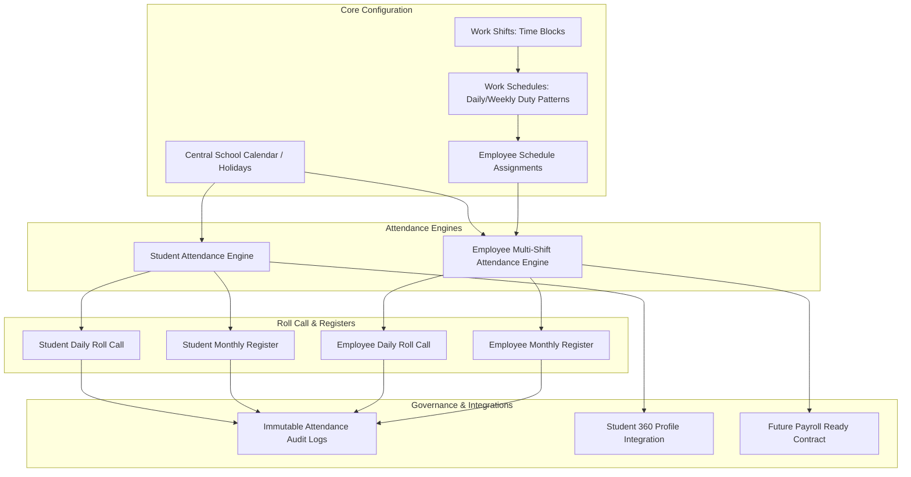

# Module 05: Attendance Management & School Calendar - Technical Specification

> [!NOTE]
> **Internal Developer & Audit Documentation**:
> This document details the technical architecture, data contracts, resolution hierarchy, and calculation engines of the **Attendance Management** module.

---

## 1. Module Overview & Architecture

The Attendance Management module provides enterprise-grade tracking for both **Student Attendance** and **Employee Attendance**, integrated natively with the **Central School Calendar & Holiday Engine**, **Work Shift Management (Time Blocks)**, and **Work Schedule Management (Duty Patterns)**.

---

## 2. A. Implemented & Verified Functionality

### 2.1. Student Attendance Management
- **Daily Section Roll Call** (`/admin/attendance`):
  - Filter by Academic Session, Class, Section, and Date.
  - Multi-status support: `PRESENT`, `ABSENT`, `LATE`, `HALF_DAY`, `EXCUSED`, `HOLIDAY`, `OFF_DAY`.
  - Batch entry with single-click "Mark All Present" default.
  - Optional per-student remarks.
- **Section Monthly Register** (`/admin/attendance/register`):
  - Matrix view displaying day-by-day status columns for the entire calendar month.
  - Consolidated student attendance metrics (Total Days, Present, Absent, Late, Half-Day, Attendance %).
- **Attendance Corrections & Immutable History** (`/admin/attendance/corrections`):
  - Two-phase workflow: first-time roll call saves immediately; updates to previously saved records require a **Mandatory Justification / Correction Reason**.
  - All edits generate immutable records in `student_attendance_audit_logs` tracking `previousStatus`, `newStatus`, `reason`, `userId`, and timestamp.
- **Student 360° Profile Integration** (`/admin/students/[id]`):
  - Live attendance tab calculating session-level attendance percentage and displaying recent attendance logs.
- **Central School Calendar & Holiday Integration** (`/admin/settings/holidays`):
  - School-wide holidays, session-specific breaks, and weekly offs (Sunday / Saturday) automatically populate on roll call as non-working days.
  - Standard attendance marking on holidays is locked unless explicitly overridden by authorized administrators.

---

### 2.2. Work Shift Management (Reusable Time Blocks)
- **Shift Definition** (`/admin/attendance/employees/shifts`):
  - Defines reusable time windows: Shift Name, Shift Code, Start Time (`HH:mm`), End Time (`HH:mm`), Grace Minutes, Early Exit Grace Minutes, Break Duration (minutes), Minimum Hours for Full Day, Minimum Hours for Half Day, and Active Working Days.
  - Supports overnight/cross-midnight shifts (e.g. `22:00 → 06:00`) with correct modulo-24 duration math.
- **Pre-configured Reusable Shifts**:
  - Full Day Standard (`08:00 → 16:00`)
  - Morning Shift (`07:00 → 11:00`)
  - Afternoon Shift (`12:00 → 16:00`)
  - Evening Shift (`17:00 → 21:00`)
  - Friday Special Shift (`08:00 → 12:30`)

---

### 2.3. Work Schedule Management (Weekly Duty Patterns)
- **Schedule Definition** (`/admin/attendance/employees/schedules`):
  - Reusable weekly duty schedules containing 0, 1, 2, 3, or more non-overlapping shifts per weekday (Monday–Sunday).
  - Shift Overlap Engine validates all shifts assigned to each day to prevent invalid overlapping configurations (e.g. `08:00–14:00` and `12:00–18:00`).
- **Bulk Schedule Assignment** (`/admin/attendance/employees/schedules/assignments`):
  - Assigns complete Work Schedules to Departments, Designations, Employment Types, or Selected Staff.
  - Live Impact Preview table displaying current vs proposed schedules before saving.
  - Supports individual employee exceptions/overrides (`isOverride = true`).
  - Effective-dated assignment model preserving historical schedules without retroactively altering past attendance interpretation.

---

### 2.4. Multiple Shifts per Employee & Complex Duty Attendance
- **Multi-Shift Roster** (`/admin/attendance/employees`):
  - Clean master employee row displaying consolidated daily totals (Total Scheduled Hours, Total Worked Hours, Consolidated Status, Total Delay) with expandable segment rows for each scheduled shift.
  - Independent check-in, check-out, status, and remarks recorded per shift segment.
- **Worked-Hours Math & Gap-Time Exclusion**:
  - Segment worked hours calculated as: `Worked = (CheckOut - CheckIn) - BreakDuration (if worked >= 4h)`.
  - Intervals/gaps between non-overlapping shifts on the same day (e.g. `11:00 → 12:00`) are strictly **excluded from worked time**.
- **Partial Attendance & Consolidated Status**:
  - Having 1 Present segment and 1 Absent segment marks the daily status as `HALF_DAY` (not fully absent).
  - Late arrival tracks delay minutes on only the delayed shift and aggregates total late minutes for the employee.
- **Monthly Employee Register** (`/admin/attendance/employees/register`):
  - Multi-shift employees appear as single distinct rows without duplicating employee counts.
- **Employee Attendance Audit Trail** (`/admin/attendance/employees/corrections`):
  - Immutable audit logs in `employee_attendance_audit_logs` linked to specific `shiftId`.

---

## 3. B. Future / Not-Yet-Implemented Functionality

The following items are architecturally planned for future phases but are **NOT** yet implemented:
1. **Biometric & RFID Hardware Sync**: Direct real-time TCP/IP / push-protocol listeners for physical ZKTeco/Hikvision attendance devices (currently simulated via API check-in/out).
2. **Automated Geofenced Mobile Check-In**: Native mobile app GPS check-in/out for field staff.
3. **Automated Payroll Deductions**: Dynamic payroll salary deductions based on late minute thresholds (the payroll data contract `getPayrollAttendanceSummary` is ready, but automated payroll batch generation belongs to Module 09).
4. **Subject-Wise Student Attendance**: Period-by-period class timetable attendance (daily section-wise attendance is implemented).

---

## 4. Schedule Resolution Hierarchy

For any employee on `attendanceDate`, the system resolves the applicable shifts via:

$$\begin{matrix}
\textbf{Level 1: Employee Schedule Override} & (\text{EmployeeScheduleAssignment with } \texttt{isOverride = true}) \\
\Downarrow & \\
\textbf{Level 2: Direct Employee Assignment} & (\text{EmployeeScheduleAssignment matching } \texttt{employeeId}) \\
\Downarrow & \\
\textbf{Level 3: Department Schedule Assignment} & (\text{EmployeeScheduleAssignment matching } \texttt{employee.departmentId}) \\
\Downarrow & \\
\textbf{Level 4: Designation Schedule Assignment} & (\text{EmployeeScheduleAssignment matching } \texttt{employee.designationId}) \\
\Downarrow & \\
\textbf{Level 5: Employment Type Assignment} & (\text{EmployeeScheduleAssignment matching } \texttt{employee.employmentTypeId}) \\
\Downarrow & \\
\textbf{Level 6: Institutional Default Schedule} & (\text{WorkSchedule with } \texttt{isDefault = true})
\end{matrix}$$

---

## 5. Database Schema Reference

- `student_attendance_records`: Unique on `[tenant_id, student_id, attendance_date]`
- `student_attendance_audit_logs`: Foreign key to `student_attendance_records`
- `shifts`: Unique on `[tenant_id, code]`
- `work_schedules`: Unique on `[tenant_id, code]`
- `work_schedule_days`: Unique on `[work_schedule_id, day_of_week]`
- `employee_schedule_assignments`: Effective-dated index on `[tenant_id, employee_id, effective_from]`
- `employee_attendance_records`: Unique on `[tenant_id, employee_id, attendance_date, shift_id]`
- `employee_attendance_audit_logs`: Foreign keys to `employee_attendance_records` and `shifts`
- `school_holidays` & `weekly_off_settings`: Managed by Central School Calendar
