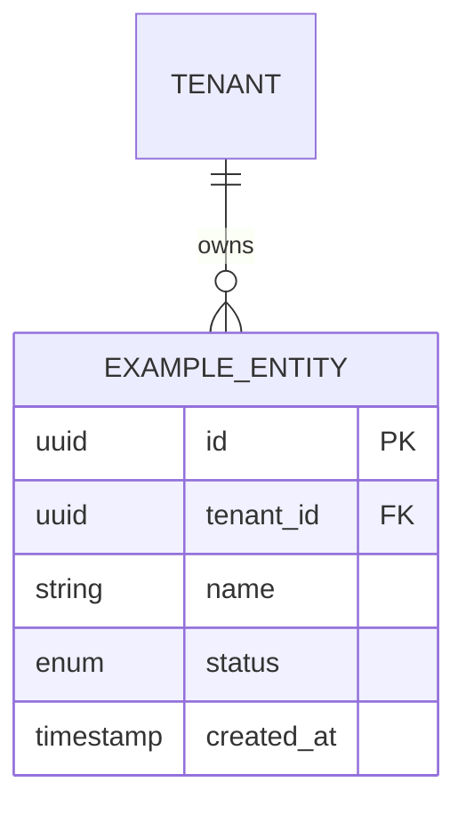

# [Module/Feature Name] - Technical Documentation

## 1. Overview
Brief summary of the module/feature, its business domain, tenant boundaries, and responsibilities.

## 2. Architecture & Component Diagram
Explanation of how the components, services, and domain models interact.

## 3. Database Schema & Data Models
Table definitions, fields, constraints, relations, `tenant_id` scoping, and indexes.

## 4. API Endpoints & Contracts
List of endpoints, request payloads, response structures, and HTTP status codes.

| Method | Endpoint | Description | Permissions Required |
| :--- | :--- | :--- | :--- |
| `GET` | `/api/v1/resource` | List items (tenant-scoped) | `RESOURCE:VIEW` |
| `POST` | `/api/v1/resource` | Create item | `RESOURCE:CREATE` |
| `PUT` | `/api/v1/resource/:id` | Update item | `RESOURCE:EDIT` |
| `DELETE`| `/api/v1/resource/:id` | Delete item | `RESOURCE:DELETE` |

## 5. Security & Permission Matrix
Actions supported (`VIEW`, `CREATE`, `EDIT`, `DELETE`, `APPROVE`, `PRINT`, `EXPORT`, `PUBLISH`, `UNPUBLISH`, `REVERSE`) and tenant isolation rules.

## 6. Financial & Publishing Engine Rules (If Applicable)
Specific safety rules, transaction invariants, approval steps, or settlement workflows.

## 7. Localization & RTL Considerations
Urdu/English terminology mappings and layout notes.

